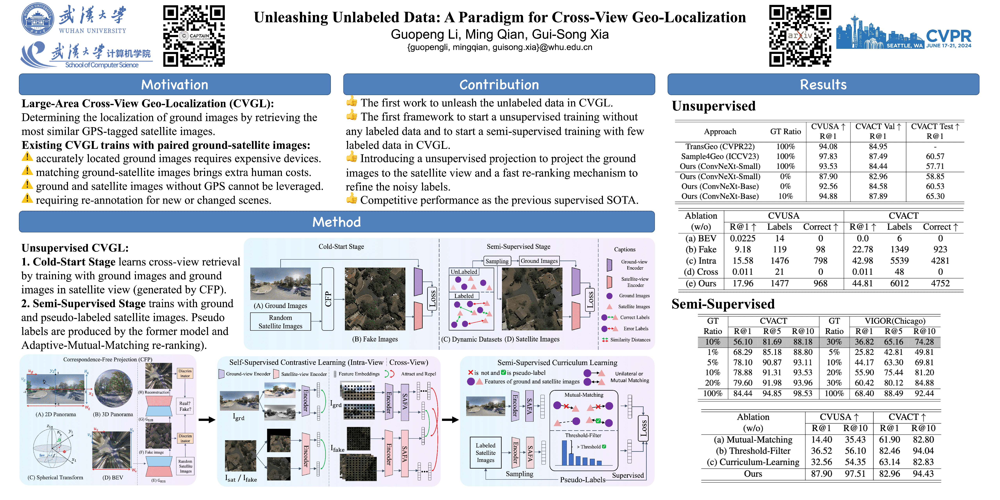

## UCVGL2024 [[paper](https://arxiv.org/abs/2403.14198)][[model](https://pan.baidu.com/s/1xH8XRzwch9hTgq5LiUxlBw?pwd=c9sh)] [[Cite](#citation)]

This repository provides the official code for CVPR2024 "[Unleashing Unlabeled Data A Paradigm for Cross-View Geo-Localization](https://arxiv.org/abs/2403.14198)".



## Citation
If you find our work useful, please star this repository and cite our paper:
```
@inproceedings{li2024unleashing,
  title={Unleashing Unlabeled Data: A Paradigm for Cross-View Geo-Localization},
  author={Li, Guopeng and Qian, Ming and Xia, Gui-Song},
  booktitle={Proceedings of the IEEE/CVF Conference on Computer Vision and Pattern Recognition},
  pages={16719--16729},
  year={2024}
}
```

## Dataset
Please prepare [VIGOR](https://github.com/Jeff-Zilence/VIGOR), [CVUSA](http://mvrl.cs.uky.edu/datasets/cvusa/) or [CVACT](https://github.com/Liumouliu/OriCNN). You need to put them in the "[data/](data/)" folder or modify the path by "soft link" (```ln -s```).

## Folder Structure:

```
├─ UCVGL
  ├── ckpt/
    ├── VIGOR/ 
    ├── CVUSA/	
    └── CVACT/
  ├── data/
    ├── VIGOR/ 
    ├── CVUSA/	
        ├── g2a/
        ├── g2a_sat/	
        ├── streetview/panos
        └── bingmap/19
    └── CVACT/
        ├── g2a/
        ├── g2a_sat/	
        ├── streetview/
        └── satview_polish/
```
where "g2a/" is produced by [CFP/GeometricProjection](CFP/GeometricProjection) and "g2a_sat/" is generated by [CFP/CycleGAN](CFP/CycleGAN). You also can find them in [this link](https://pan.baidu.com/s/1PSRBpEBb6mew71IptHDrsA?pwd=6mwe).
## Requirement
```
1. conda create --name UCVGL python=3.8
2. conda activate UCVGL
3. conda install pytorch==2.0.0 torchvision==0.15.0 torchaudio==2.0.0 pytorch-cuda=11.7 -c pytorch -c nvidia
4. pip install -r requirements.txt
```
For Step3, you should install corresponding Torch in [this page](https://pytorch.org/get-started/previous-versions/) according to your CUDA version.
	
## Training and Evaluation
    bash run_CVUSA.sh
    bash run_CVACT.sh
    bash run_VIGOR.sh

## Reference
    - http://mvrl.cs.uky.edu/datasets/cvusa/
    - https://github.com/Jeff-Zilence/VIGOR
    - https://github.com/Liumouliu/OriCNN
    - https://github.com/junyanz/pytorch-CycleGAN-and-pix2pix
    - https://github.com/Jeff-Zilence/TransGeo2022
    - https://github.com/Skyy93/Sample4Geo
